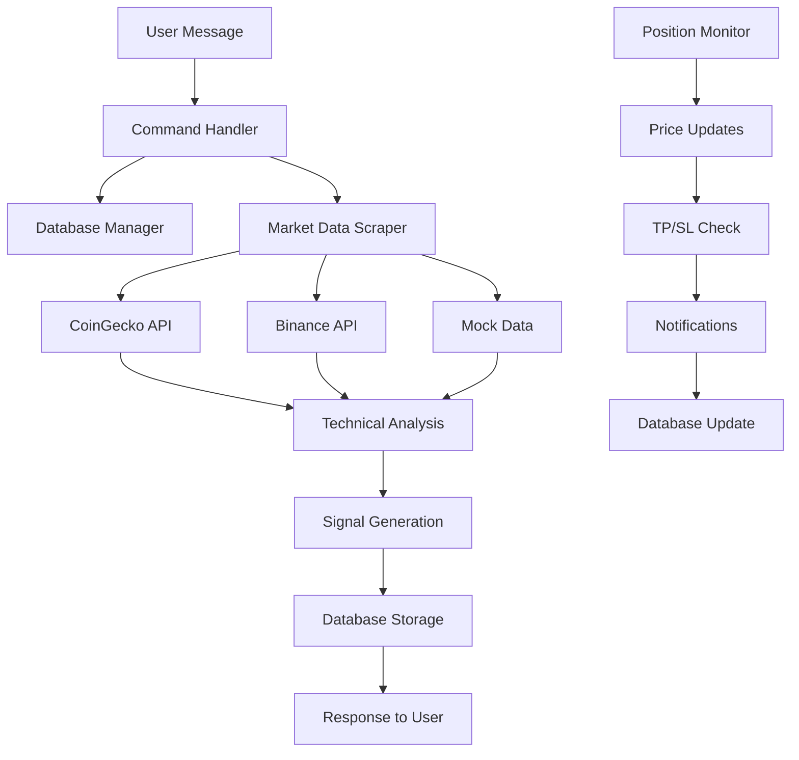

# 🤖 Modular Crypto Trading Bot

Bot trading cryptocurrency dengan arsitektur modular yang memberikan sinyal analisis teknikal real-time melalui Telegram. Bot ini menggunakan data market dari berbagai sumber (CoinGecko, Binance API) dan memberikan analisis komprehensif untuk membantu keputusan trading.

## ✨ Fitur Utama

🤖 **Bot Telegram Interaktif**
- Command-based interface dengan inline keyboards yang intuitif
- Interactive session untuk pemilihan simbol dan timeframe
- Real-time notifications untuk TP/SL hits dan price alerts
- Admin broadcast system untuk pengumuman ke semua user

📊 **Analisis Market Komprehensif**
- Data real-time dari CoinGecko API (fallback dari Binance API)
- 15+ indikator teknikal: RSI, MACD, Moving Averages, Bollinger Bands, dll
- Sinyal trading otomatis (LONG/SHORT/NEUTRAL) dengan confidence level
- Dynamic TP/SL calculation berdasarkan volatilitas market (ATR)

📈 **Position & Risk Management**
- Real-time monitoring posisi trading dengan PnL calculation
- Automatic TP/SL detection dan notifikasi instant
- Risk/Reward ratio calculation untuk setiap sinyal
- Database SQLite untuk persistensi semua data trading

🔔 **Price Alerts System**
- Custom price alerts per user dengan kondisi above/below
- Automatic triggering dan notifikasi real-time
- Multiple alerts per user untuk berbagai simbol
- Alert history tracking di database

⚙️ **User Management & Settings**
- User registration otomatis dengan tracking interaksi
- Customizable risk percentage dan reward ratio
- Preferred timeframe settings per user
- Admin panel untuk broadcast dan statistik bot

🛡️ **Security & Data Privacy**
- Tidak menggunakan API exchange yang membutuhkan API key trading
- Data user tersimpan lokal di SQLite
- Environment variables untuk semua credential sensitif
- Logging komprehensif untuk debugging dan monitoring

## 🏗️ Arsitektur Modular

Bot ini dibangun dengan arsitektur modular untuk maintainability dan scalability yang tinggi:

```
crypto_trading_bot/
├── 📁 Project Root
│   ├── bot.py                      # 🚀 Main entry point & bot initialization
│   ├── config.py                   # ⚙️ Global configuration & constants
│   ├── database.py                 # 🗄️ SQLite database manager & models
│   ├── requirements_new.txt        # 📦 Python dependencies
│   ├── start_modular_bot.sh       # 🎬 Shell script launcher
│   ├── .env                       # 🔒 Environment variables (tidak di-commit)
│   ├── .env.example              # 📝 Template environment variables
│   └── .gitignore                # 🚫 Git ignore rules
│
├── 📁 handlers/                   # 🎮 Event handlers & business logic
│   ├── command_handlers.py       # 📨 Telegram commands & callback handlers
│   └── position_monitor.py       # 📊 Real-time position monitoring
│
├── 📁 scripts/                   # 🔧 Utility scripts & data fetching
│   └── tradingview_scraper.py    # 📈 Market data scraper & technical analysis
│
├── 📁 keyboards/                 # ⌨️ Telegram inline keyboards
│   └── bot_keyboards.py          # 🎹 All keyboard layouts & buttons
│
└── 📁 Database Files (auto-generated)
    ├── crypto_bot.db             # 🗃️ SQLite database
    ├── crypto_bot.log            # 📋 Application logs
    └── crypto_bot_session.session # 🔗 Telegram session file
```

### 🔧 Komponen Utama

#### 🚀 `bot.py` - Main Application
**Fungsi:** Entry point utama yang menginisialisasi semua komponen
- Memuat konfigurasi dari environment variables
- Menginisialisasi TelegramClient dengan Telethon
- Setup database dan semua tabel
- Mendaftarkan semua event handlers
- Memulai position monitoring background task
- Mengirim startup notification ke admin

#### ⚙️ `config.py` - Configuration Manager  
**Fungsi:** Centralized configuration dan konstanta
- Environment variables loading dengan python-dotenv
- Bot messages templates (welcome, help, error messages)
- Supported symbols dan timeframes list
- Default trading parameters (risk %, reward ratio)
- Logging configuration

#### 🗄️ `database.py` - Database Manager
**Fungsi:** SQLite database operations dengan async support
- **Tables:** users, positions, alerts, signals_history, broadcasts, user_interactions
- **CRUD Operations:** Create, Read, Update, Delete untuk semua entitas
- **User Management:** Registration, preferences, interaction tracking
- **Trading Data:** Positions, signals, PnL calculation
- **Alerts System:** Price alerts dengan automatic triggering
- **Analytics:** User statistics, bot performance metrics

#### 📨 `handlers/command_handlers.py` - Command Processor
**Fungsi:** Menangani semua Telegram commands dan callbacks
- **Commands:** `/start`, `/analyze`, `/positions`, `/alerts`, `/settings`, `/admin`
- **Interactive Sessions:** Multi-step input untuk symbol selection
- **Callback Handlers:** Inline keyboard button processing
- **Admin Functions:** Broadcast system, user statistics
- **Signal Processing:** Market analysis results formatting
- **Error Handling:** User-friendly error messages

#### 📊 `handlers/position_monitor.py` - Real-time Monitor
**Fungsi:** Background monitoring untuk posisi dan alerts
- **Position Tracking:** Real-time PnL calculation
- **TP/SL Detection:** Automatic profit/loss hit detection  
- **Price Alerts:** Continuous price monitoring vs user targets
- **Notifications:** Instant Telegram notifications
- **Database Updates:** Position status dan alert triggering
- **Performance:** Efficient polling dengan rate limiting

#### 📈 `scripts/tradingview_scraper.py` - Market Data Engine
**Fungsi:** Data fetching dan technical analysis engine
- **Data Sources:** CoinGecko API (primary), Binance API (fallback), Mock data (testing)
- **Technical Indicators:** RSI, MACD, Moving Averages, Bollinger Bands, ATR
- **Signal Generation:** LONG/SHORT/NEUTRAL dengan confidence scoring
- **Risk Calculation:** Dynamic TP/SL berdasarkan market volatility
- **Error Handling:** Graceful fallback antar data sources
- **Rate Limiting:** Respect API rate limits dengan retry logic

#### 🎹 `keyboards/bot_keyboards.py` - UI Components
**Fungsi:** Semua inline keyboard layouts untuk Telegram UI
- **Main Menu:** Primary navigation buttons
- **Symbol Selection:** Cryptocurrency selection grid
- **Timeframe Selection:** Trading timeframe options
- **Signal Actions:** Open position, set alerts, share signals
- **Admin Panel:** Broadcast, statistics, user management
- **Settings Menu:** User preferences dan configuration

## 🚀 Installation & Setup

### 1. Prerequisites
```bash
# Python 3.8+ required
python3 --version

# Git untuk cloning repository
git --version
```

### 2. Clone & Setup Environment
```bash
# Clone repository
git clone <repository_url>
cd crypto_trading_bot

# Create virtual environment (highly recommended)
python3 -m venv came_venv
source came_venv/bin/activate  # Linux/Mac
# atau
came_venv\Scripts\activate     # Windows

# Install dependencies
pip install -r requirements_new.txt
```

### 3. Telegram Bot Setup

#### 3.1 Create Telegram Bot
1. Chat dengan [@BotFather](https://t.me/BotFather) di Telegram
2. Gunakan command `/newbot`
3. Ikuti instruksi untuk membuat bot baru
4. **Simpan Bot Token** yang diberikan (format: `123456:ABC-DEF1234ghIkl-zyx57W2v1u123ew11`)

#### 3.2 Get Telegram API Credentials
1. Kunjungi [https://my.telegram.org/apps](https://my.telegram.org/apps)
2. Login dengan akun Telegram Anda
3. Click "Create new application"
4. Isi form aplikasi:
   - **App title:** Crypto Trading Bot
   - **Short name:** crypto_bot
   - **Platform:** Desktop
5. **Simpan API ID dan API Hash** yang diberikan

#### 3.3 Get Admin User ID
1. Chat dengan [@userinfobot](https://t.me/userinfobot) di Telegram
2. Bot akan memberikan User ID Anda (contoh: `7300772742`)
3. **Simpan User ID** ini sebagai ADMIN_ID

### 4. Configuration Setup
```bash
# Copy template environment file
cp .env.example .env

# Edit configuration file
nano .env  # atau gunakan editor lain
```

Isi file `.env` dengan credentials Anda:
```env
# Telegram Configuration
API_ID=your_telegram_api_id
API_HASH=your_telegram_api_hash  
BOT_TOKEN=your_bot_token_from_botfather
ADMIN_ID=your_user_id

# Trading Configuration  
DEFAULT_RISK_PERCENTAGE=2.0
DEFAULT_REWARD_RATIO=2.0
MAX_POSITIONS=5
ANALYSIS_INTERVAL=300
ENABLE_NOTIFICATIONS=true

# Database Configuration
DATABASE_PATH=crypto_bot.db
LOG_LEVEL=INFO
```

### 5. First Run & Verification
```bash
# Make script executable
chmod +x start_modular_bot.sh

# Run bot for first time
./start_modular_bot.sh

# Atau jalankan langsung dengan Python
python3 bot.py
```

**Expected Output:**
```
🚀 Initializing Crypto Trading Bot...
✅ Database initialized
✅ Command handlers registered  
✅ Position monitor initialized
🎉 Bot initialization completed
✅ Telegram client started
🤖 Bot started as @YourBotName (ID: 123456789)
✅ Startup notification sent to admin
🔄 Position monitoring started
🟢 Crypto Trading Bot is now running!
```

### 6. Test Bot Functionality
1. **Start bot conversation:**
   - Cari bot Anda di Telegram: `@YourBotName`
   - Send command `/start`
   - Verifikasi welcome message dan keyboard muncul

2. **Test market analysis:**
   - Send command `/analyze`
   - Pilih symbol (contoh: BTC/USDT)
   - Pilih timeframe (contoh: 1h)
   - Verifikasi analisis hasil muncul dengan data real

3. **Check admin functions:**
   - Send command `/admin` (hanya untuk admin)
   - Verifikasi akses admin panel dan statistics

## 📖 Usage Guide

### 🎮 Menjalankan Bot

```bash
# Method 1: Using shell script (recommended)
./start_modular_bot.sh

# Method 2: Direct Python execution
python3 bot.py

# Method 3: Background process
nohup python3 bot.py > bot.log 2>&1 &

# Method 4: Development mode dengan logs
python3 bot.py | tee -a crypto_bot.log
```

### 📱 Telegram Commands

#### 👤 User Commands
- **`/start`** - Mulai menggunakan bot, registrasi user baru
- **`/analyze [SYMBOL] [TIMEFRAME]`** - Analisis market dengan parameter opsional
- **`/positions`** - Lihat semua posisi trading aktif dengan PnL
- **`/alerts`** - Kelola price alerts (create, view, delete)
- **`/settings`** - Pengaturan personal (risk %, timeframe, notifications)
- **`/help`** - Bantuan lengkap penggunaan bot

#### 👑 Admin Commands (hanya untuk ADMIN_ID)
- **`/admin`** - Panel admin dengan statistics dan controls
- **`/broadcast <message>`** - Kirim pesan ke semua user terdaftar

### 🎯 Interactive Usage Examples

#### 1. **Market Analysis - Quick Mode**
```
User: /analyze BTC 1h
Bot: 🔄 Analyzing BTC/USDT on 1h timeframe...
     [Analysis results with signals]
```

#### 2. **Market Analysis - Interactive Mode**
```
User: /analyze
Bot: 📊 Choose cryptocurrency symbol:
User: [Clicks BTC/USDT button]
Bot: ⏰ Select timeframe:
User: [Clicks 1h button]  
Bot: 🔄 Analyzing BTC/USDT on 1h timeframe...
     [Detailed analysis with TP/SL]
```

#### 3. **Position Monitoring**
```
User: /positions
Bot: 📈 Active Trading Positions

     1. BTC/USDT 📈
     • Entry: $43,250.00
     • Current: $44,100.00  
     • PnL: 🟢 +1.97%
     • TP: $48,500.00
     • SL: $40,000.00

     🟢 Average PnL: +1.97%
```

#### 4. **Price Alerts Setup**
```
User: /alerts
Bot: 🔔 Price Alerts Management
User: [Clicks "Add Alert" button]
Bot: 📊 Choose symbol for alert:
User: [Clicks BTC/USDT]
Bot: 💰 Enter target price:
User: 50000
Bot: ⚡ Choose condition:
User: [Clicks "Above" button]
Bot: ✅ Alert created! You'll be notified when BTC/USDT goes above $50,000
```

#### 5. **Admin Broadcasting**
```
Admin: /broadcast 🚨 Maintenance will start at 10 PM UTC. Bot will be down for 30 minutes.
Bot: 📢 Broadcasting to 150 users...
     ✅ Message sent to 147 users successfully
     ❌ 3 users unreachable
```

### 🔧 Advanced Features

#### **Multi-Source Data Fetching**
Bot menggunakan multiple data sources dengan fallback system:
1. **CoinGecko API** (Primary) - Real-time prices + 24h data
2. **Binance API** (Fallback) - Klines data untuk technical analysis  
3. **Mock Data** (Testing) - Simulated data ketika APIs down

#### **Intelligent Signal Analysis**
```python
# Example signal output
{
    "signal": "LONG",           # LONG/SHORT/NEUTRAL
    "confidence": 78.5,         # 0-100% confidence score
    "entry_price": 43250.00,    # Recommended entry price
    "take_profit": 48500.00,    # Target profit level
    "stop_loss": 40000.00,      # Risk management level
    "risk_reward_ratio": 1.67,  # Risk vs reward calculation
    "analysis": {
        "rsi": "Oversold (RSI: 28.5)",
        "macd": "Bullish crossover",
        "ma": "Price above moving averages", 
        "bb": "Price near lower band",
        "trend": "Strong uptrend (82.3%)"
    }
}
```

#### **Real-time Notifications**
- **TP Hit:** `🎯 BTCUSDT TP Hit! Entry: $43,250 → Exit: $48,500 (+12.15% profit)`
- **SL Hit:** `🛑 BTCUSDT SL Hit! Entry: $43,250 → Exit: $40,000 (-7.52% loss)`
- **Price Alert:** `🔔 BTCUSDT Alert! Price $50,250 is now ABOVE your target $50,000`

## 📊 Technical Analysis Engine

### 🔍 Supported Indicators

Bot menggunakan comprehensive technical analysis dengan 15+ indicators:

#### **Momentum Indicators**
- **RSI (Relative Strength Index):** Overbought/oversold conditions (14-period)
- **Stochastic Oscillator:** Momentum comparison (14,3,3 parameters)  
- **Williams %R:** Momentum indicator untuk entry timing

#### **Trend Indicators**
- **MACD (Moving Average Convergence Divergence):** Trend changes (12,26,9)
- **Moving Averages:** SMA-20, EMA-12, EMA-26 for trend direction
- **ADX (Average Directional Index):** Trend strength measurement

#### **Volatility Indicators**  
- **Bollinger Bands:** Price volatility dan support/resistance (20,2)
- **ATR (Average True Range):** Volatility untuk TP/SL calculation
- **Standard Deviation:** Price dispersion analysis

#### **Volume Indicators**
- **OBV (On-Balance Volume):** Volume-price relationship
- **Volume SMA:** Volume trend analysis
- **Volume Rate of Change:** Volume momentum

### 🧠 Signal Generation Logic

#### **Multi-Factor Analysis**
```python
# Simplified signal logic
def generate_signal(indicators):
    signals = []
    confidence_factors = []
    
    # RSI Analysis
    if rsi < 30:  # Oversold
        signals.append('LONG')
        confidence_factors.append(0.8)
    elif rsi > 70:  # Overbought  
        signals.append('SHORT')
        confidence_factors.append(0.8)
    
    # MACD Analysis
    if macd > macd_signal and macd_histogram > 0:
        signals.append('LONG')
        confidence_factors.append(0.7)
    
    # Moving Average Analysis
    if price > sma_20 > ema_50:
        signals.append('LONG')
        confidence_factors.append(0.6)
    
    # Bollinger Bands Analysis
    if price <= bb_lower:  # Potential bounce
        signals.append('LONG')
        confidence_factors.append(0.5)
    elif price >= bb_upper:  # Potential rejection
        signals.append('SHORT')
        confidence_factors.append(0.5)
    
    # Determine overall signal
    long_signals = signals.count('LONG')
    short_signals = signals.count('SHORT')
    
    if long_signals > short_signals:
        return 'LONG', calculate_confidence(confidence_factors)
    elif short_signals > long_signals:
        return 'SHORT', calculate_confidence(confidence_factors)
    else:
        return 'NEUTRAL', 0.3
```

#### **Confidence Scoring System**
- **80-100%:** Very High Confidence - Multiple strong indicators align
- **60-79%:** High Confidence - Most indicators agree with some divergence
- **40-59%:** Medium Confidence - Mixed signals with slight bias
- **20-39%:** Low Confidence - Conflicting signals, high uncertainty  
- **0-19%:** Very Low Confidence - No clear direction, avoid trading

#### **Dynamic Risk Management**
```python
# TP/SL Calculation based on ATR
def calculate_risk_levels(current_price, signal, atr):
    if signal == 'LONG':
        stop_loss = current_price - (atr * 1.5)      # 1.5x ATR below entry
        take_profit = current_price + (atr * 2.5)     # 2.5x ATR above entry
    elif signal == 'SHORT':
        stop_loss = current_price + (atr * 1.5)      # 1.5x ATR above entry  
        take_profit = current_price - (atr * 2.5)     # 2.5x ATR below entry
    
    risk_reward_ratio = abs(take_profit - current_price) / abs(current_price - stop_loss)
    return take_profit, stop_loss, risk_reward_ratio
```

### 📈 Supported Markets & Timeframes

#### **Cryptocurrency Pairs**
```python
SUPPORTED_SYMBOLS = [
    'BTCUSDT', 'ETHUSDT', 'BNBUSDT', 'ADAUSDT', 'XRPUSDT',
    'SOLUSDT', 'DOTUSDT', 'DOGEUSDT', 'AVAXUSDT', 'MATICUSDT',
    'LINKUSDT', 'LTCUSDT', 'UNIUSDT', 'ATOMUSDT', 'FILUSDT'
]
```

#### **Analysis Timeframes**
```python
SUPPORTED_TIMEFRAMES = [
    '1m',   # 1 minute - Scalping
    '5m',   # 5 minutes - Short-term  
    '15m',  # 15 minutes - Day trading
    '1h',   # 1 hour - Swing trading
    '4h',   # 4 hours - Position trading
    '1d'    # 1 day - Long-term analysis
]
```

## 🗄️ Database Schema & Architecture

### 📋 Database Tables

#### **`users` Table - User Management**
```sql
CREATE TABLE users (
    user_id INTEGER PRIMARY KEY,           -- Telegram User ID
    username TEXT,                         -- Telegram username
    first_name TEXT,                       -- User's first name  
    last_name TEXT,                        -- User's last name
    risk_percentage REAL DEFAULT 2.0,     -- Default risk per trade
    preferred_timeframe TEXT DEFAULT '1h', -- Preferred analysis timeframe
    notifications_enabled INTEGER DEFAULT 1, -- Push notifications on/off
    created_at TIMESTAMP DEFAULT CURRENT_TIMESTAMP,
    last_active TIMESTAMP DEFAULT CURRENT_TIMESTAMP
);
```

#### **`positions` Table - Trading Positions**
```sql  
CREATE TABLE positions (
    id INTEGER PRIMARY KEY AUTOINCREMENT,
    user_id INTEGER,                       -- Reference to users table
    symbol TEXT NOT NULL,                  -- Trading pair (e.g., BTCUSDT)
    position_type TEXT NOT NULL,          -- 'long' or 'short'
    entry_price REAL NOT NULL,            -- Entry price
    quantity REAL NOT NULL,               -- Position size
    take_profit REAL,                     -- Target profit price
    stop_loss REAL,                       -- Stop loss price
    current_price REAL,                   -- Last known price
    pnl REAL DEFAULT 0,                   -- Profit/Loss amount
    status TEXT DEFAULT 'open',           -- 'open', 'closed', 'tp_hit', 'sl_hit'
    timeframe TEXT NOT NULL,              -- Analysis timeframe
    created_at TIMESTAMP DEFAULT CURRENT_TIMESTAMP,
    closed_at TIMESTAMP,
    FOREIGN KEY (user_id) REFERENCES users (user_id)
);
```

#### **`alerts` Table - Price Alerts**
```sql
CREATE TABLE alerts (
    id INTEGER PRIMARY KEY AUTOINCREMENT,
    user_id INTEGER,                      -- Reference to users table
    symbol TEXT NOT NULL,                 -- Cryptocurrency pair
    alert_type TEXT NOT NULL,             -- 'price_above', 'price_below'
    target_price REAL NOT NULL,           -- Target alert price
    current_price REAL,                   -- Price when alert was created
    message TEXT,                         -- Custom alert message
    is_triggered INTEGER DEFAULT 0,       -- Alert status (0=active, 1=triggered)
    created_at TIMESTAMP DEFAULT CURRENT_TIMESTAMP,
    triggered_at TIMESTAMP,
    FOREIGN KEY (user_id) REFERENCES users (user_id)
);
```

#### **`signals_history` Table - Analysis History**
```sql
CREATE TABLE signals_history (
    id INTEGER PRIMARY KEY AUTOINCREMENT,
    symbol TEXT NOT NULL,                 -- Trading pair
    timeframe TEXT NOT NULL,              -- Analysis timeframe  
    signal_type TEXT NOT NULL,            -- 'long', 'short', 'neutral'
    price REAL NOT NULL,                  -- Price at analysis time
    rsi REAL,                            -- RSI value
    macd REAL,                           -- MACD line value
    macd_signal REAL,                    -- MACD signal line
    ma_short REAL,                       -- Short MA value
    ma_long REAL,                        -- Long MA value
    bb_upper REAL,                       -- Bollinger upper band
    bb_lower REAL,                       -- Bollinger lower band
    volume REAL,                         -- Trading volume
    strength INTEGER,                    -- Signal strength (1-5)
    take_profit REAL,                    -- Calculated TP
    stop_loss REAL,                      -- Calculated SL
    created_at TIMESTAMP DEFAULT CURRENT_TIMESTAMP
);
```

#### **`broadcasts` Table - Admin Messages**
```sql
CREATE TABLE broadcasts (
    id INTEGER PRIMARY KEY AUTOINCREMENT,
    admin_id INTEGER NOT NULL,            -- Admin who sent message
    message TEXT NOT NULL,                -- Broadcast content
    target_count INTEGER,                 -- Total target users
    sent_count INTEGER DEFAULT 0,         -- Successfully sent count
    failed_count INTEGER DEFAULT 0,       -- Failed delivery count
    created_at TIMESTAMP DEFAULT CURRENT_TIMESTAMP,
    completed_at TIMESTAMP
);
```

#### **`user_interactions` Table - Analytics**
```sql
CREATE TABLE user_interactions (
    id INTEGER PRIMARY KEY AUTOINCREMENT,
    user_id INTEGER,                      -- User who performed action
    interaction_type TEXT NOT NULL,       -- Action type (command, callback, etc.)
    details TEXT,                         -- Additional interaction data
    timestamp TIMESTAMP DEFAULT CURRENT_TIMESTAMP,
    FOREIGN KEY (user_id) REFERENCES users (user_id)
);
```

### 🔄 Data Flow Architecture



### 📊 Key Database Operations

#### **User Management**
```python
# Register new user
await db.add_user(user_id, username, first_name, last_name)

# Update user preferences  
await db.update_user_settings(user_id, risk_percentage=3.0, timeframe='4h')

# Track user interactions
await db.log_interaction(user_id, 'analyze_command', 'BTCUSDT-1h')
```

#### **Position Tracking**
```python
# Add new position
position_id = await db.add_position(
    user_id=123456,
    symbol='BTCUSDT', 
    position_type='long',
    entry_price=43250.0,
    quantity=0.1,
    timeframe='1h',
    take_profit=48500.0,
    stop_loss=40000.0
)

# Update position with current price
await db.update_position(position_id, current_price=44100.0, pnl=850.0)

# Close position
await db.close_position(position_id, exit_price=48500.0, status='tp_hit')
```

#### **Alert Management**
```python
# Create price alert
alert_id = await db.add_alert(
    user_id=123456,
    symbol='BTCUSDT',
    alert_type='price_above', 
    target_price=50000.0,
    current_price=43250.0
)

# Trigger alert
await db.trigger_alert(alert_id)

# Get active alerts for monitoring
alerts = await db.get_active_alerts()
```

### 📈 Analytics & Reporting

#### **Bot Statistics**
```python
stats = await db.get_stats()
# Returns:
{
    'total_users': 150,
    'active_users_24h': 45,
    'total_positions': 324,
    'open_positions': 12,
    'total_signals': 1250,
    'total_alerts': 89,
    'active_alerts': 23
}
```

#### **User Performance Tracking**
```python
user_stats = await db.get_user_stats(user_id)
# Returns:
{
    'total_positions': 15,
    'winning_positions': 9,
    'losing_positions': 4,
    'win_rate': 0.75,
    'total_pnl': 1250.0,
    'avg_pnl_per_trade': 83.33
}
```

## 🛠️ Troubleshooting & Maintenance

### ❗ Common Issues & Solutions

#### **1. Installation Problems**

**Python/pip Issues:**
```bash
# macOS dengan Apple Silicon
pip install --upgrade pip
pip install numpy pandas --no-cache-dir

# Atau gunakan conda
conda create -n crypto_bot python=3.9
conda activate crypto_bot
conda install pandas numpy aiohttp

# Linux/Ubuntu missing dependencies
sudo apt-get update
sudo apt-get install python3-dev python3-pip
```

**Virtual Environment Problems:**
```bash
# Recreate virtual environment
rm -rf came_venv
python3 -m venv came_venv
source came_venv/bin/activate
pip install -r requirements_new.txt
```

#### **2. Telegram Authentication Errors**

**Session File Issues:**
```bash
# Delete session file dan restart
rm crypto_bot_session.session*
python3 bot.py
# Bot akan ask untuk phone number verification
```

**API Credentials Error:**
```bash
# Verify .env file
cat .env | grep -E "(API_ID|API_HASH|BOT_TOKEN)"

# Regenerate credentials jika perlu:
# 1. https://my.telegram.org/apps untuk API_ID/HASH
# 2. @BotFather untuk BOT_TOKEN baru
```

#### **3. Database Errors**

**Database Locked:**
```bash
# Check for stuck processes
ps aux | grep python3 | grep bot.py
kill -9 <process_id>

# Database akan auto-recover saat restart
python3 bot.py
```

**Corrupted Database:**
```bash
# Backup existing database
cp crypto_bot.db crypto_bot.db.backup

# Recreate database (akan kehilangan data)
rm crypto_bot.db
python3 bot.py
```

#### **4. Market Data Issues**

**API Rate Limiting:**
```
Error: CoinGecko API rate limit exceeded
Solution: Bot akan automatic fallback ke mock data
Wait: 1-2 minutes untuk rate limit reset
```

**Network Connection:**
```bash
# Test connectivity
curl -s "https://api.coingecko.com/api/v3/ping" | jq
curl -s "https://api.binance.com/api/v3/ping" | jq

# Check firewall/proxy settings
export https_proxy=your_proxy_if_needed
```

#### **5. Memory & Performance Issues**

**High Memory Usage:**
```bash
# Monitor bot resource usage
ps aux | grep bot.py
top -p $(pgrep -f bot.py)

# Restart bot daily untuk cleanup (cron job)
0 4 * * * /path/to/restart_bot.sh
```

### 📋 Monitoring & Logs

#### **Real-time Log Monitoring**
```bash
# Tail active logs
tail -f crypto_bot.log

# Filter specific events
grep "ERROR" crypto_bot.log | tail -20
grep "Position" crypto_bot.log | tail -10
grep "Signal" crypto_bot.log | tail -15

# Monitor database operations
grep "Database" crypto_bot.log | tail -10
```

#### **Log Analysis**
```bash
# Count error types
grep "ERROR" crypto_bot.log | cut -d'-' -f4 | sort | uniq -c

# Performance monitoring
grep "Processing time" crypto_bot.log | tail -20

# User activity analysis
grep "User interaction" crypto_bot.log | wc -l
```

#### **System Health Checks**
```bash
# Check bot process status
pgrep -f "python3 bot.py" || echo "Bot not running!"

# Check database accessibility
sqlite3 crypto_bot.db "SELECT COUNT(*) FROM users;"

# Check Telegram connectivity
python3 -c "
from telethon import TelegramClient
import os
client = TelegramClient('test', os.getenv('API_ID'), os.getenv('API_HASH'))
print('Telegram connection: OK' if client.connect() else 'FAILED')
"
```

### 🔧 Development & Testing

#### **Testing Individual Components**
```bash
# Test market data scraper
python3 -c "
import asyncio
from scripts.tradingview_scraper import TradingViewScraper, TechnicalAnalysis

async def test():
    async with TradingViewScraper() as scraper:
        data = await scraper.get_market_data('BTCUSDT', '1h')
        signal = TechnicalAnalysis.calculate_signal_strength(data)
        print(f'Signal: {signal[\"signal\"]} ({signal[\"confidence\"]}%)')

asyncio.run(test())
"

# Test database operations
python3 -c "
import asyncio
from database import DatabaseManager

async def test():
    db = DatabaseManager()
    await db.initialize()
    stats = await db.get_stats()
    print(f'Database stats: {stats}')

asyncio.run(test())
"

# Test position monitoring
python3 -c "
import asyncio
from handlers.position_monitor import PositionMonitor
from database import DatabaseManager

async def test():
    db = DatabaseManager()
    await db.initialize()
    monitor = PositionMonitor(None, db)  # No client for testing
    positions = await db.get_all_open_positions()
    print(f'Open positions: {len(positions)}')

asyncio.run(test())
"
```

#### **Adding New Features**

**New Technical Indicator:**
1. Edit `scripts/tradingview_scraper.py`
2. Add calculation in `_calculate_technical_indicators()`
3. Add signal logic in `calculate_signal_strength()`
4. Update confidence scoring system

**New Command:**
1. Add handler in `handlers/command_handlers.py`
2. Register event in `register_handlers()`
3. Add keyboard buttons in `keyboards/bot_keyboards.py`
4. Update help message in `config.py`

**New Database Table:**
1. Add table creation in `database.py` `initialize()`
2. Add CRUD methods in `DatabaseManager` class
3. Update migration logic untuk existing databases

### 🔄 Backup & Recovery

#### **Database Backup**
```bash
# Automated backup script
#!/bin/bash
BACKUP_DIR="/path/to/backups"
DATE=$(date +%Y%m%d_%H%M%S)
cp crypto_bot.db "$BACKUP_DIR/crypto_bot_$DATE.db"
find "$BACKUP_DIR" -name "crypto_bot_*.db" -mtime +7 -delete
```

#### **Configuration Backup**
```bash
# Backup critical files (tanpa .env untuk security)
tar -czf bot_backup.tar.gz \
    bot.py config.py database.py requirements_new.txt \
    handlers/ scripts/ keyboards/ \
    --exclude=__pycache__ --exclude=*.pyc
```

#### **Recovery Process**
```bash
# Restore from backup
cp backup/crypto_bot_20250101_120000.db crypto_bot.db

# Verify database integrity
sqlite3 crypto_bot.db "PRAGMA integrity_check;"

# Restart bot
python3 bot.py
```

## 🛡️ Security & Privacy

### 🔒 Security Considerations

#### **API Security**
- ✅ **Tidak menggunakan exchange API keys** - Bot hanya membaca data publik
- ✅ **Environment variables** - Semua credentials disimpan di `.env` (tidak di-commit)
- ✅ **Rate limiting** - Built-in protection terhadap API abuse
- ✅ **Graceful fallbacks** - Multiple data sources mencegah single point of failure

#### **Telegram Security**
- ✅ **Session management** - Secure session handling dengan Telethon
- ✅ **Admin-only commands** - Broadcast dan admin functions terbatas ke ADMIN_ID
- ✅ **Input validation** - Semua user input divalidasi dan disanitasi
- ✅ **Error handling** - Sensitive error details tidak dikirim ke user

#### **Database Security**
- ✅ **Local storage** - SQLite database tersimpan lokal (tidak cloud)
- ✅ **No financial data** - Tidak menyimpan API keys atau financial credentials
- ✅ **User privacy** - Minimal data collection, hanya untuk functionality
- ✅ **Data retention** - Optional cleanup untuk old data

#### **Code Security**
```python
# Environment variable validation
def validate_env_vars():
    required_vars = ['API_ID', 'API_HASH', 'BOT_TOKEN', 'ADMIN_ID']
    missing = [var for var in required_vars if not os.getenv(var)]
    if missing:
        raise ValueError(f"Missing environment variables: {missing}")

# Input sanitization
def sanitize_symbol(symbol):
    return re.sub(r'[^A-Z0-9]', '', symbol.upper())[:20]

# Admin verification
async def verify_admin(event):
    return event.sender_id == int(os.getenv('ADMIN_ID', 0))
```

### 🔐 Privacy Protection

#### **Data Collection**
Bot hanya mengumpulkan data minimal yang diperlukan:
- **User ID** - Untuk identifikasi Telegram user
- **Username/Name** - Untuk personalisasi pesan
- **Trading preferences** - Risk settings, timeframe preferences
- **Position data** - Entry/exit prices, PnL (tidak ada dana riil)
- **Interaction logs** - Untuk analytics dan debugging

#### **Data Not Collected**
- ❌ Exchange API keys atau credentials
- ❌ Real trading account information
- ❌ Financial account details
- ❌ Personal identification documents
- ❌ Location atau device information
- ❌ Private conversations content

#### **Data Retention Policy**
```python
# Automatic cleanup (recommended cron job)
async def cleanup_old_data():
    # Remove old signals (>30 days)
    await db.execute("DELETE FROM signals_history WHERE created_at < datetime('now', '-30 days')")
    
    # Remove triggered alerts (>7 days)
    await db.execute("DELETE FROM alerts WHERE is_triggered = 1 AND triggered_at < datetime('now', '-7 days')")
    
    # Remove old interactions (>90 days)
    await db.execute("DELETE FROM user_interactions WHERE timestamp < datetime('now', '-90 days')")
```

### ⚠️ Important Disclaimers

#### **Trading Disclaimer**
🚨 **PENTING:** Bot ini hanya memberikan sinyal analisis teknikal untuk tujuan **edukasi dan informasi**. 

- ❌ **Bot TIDAK mengeksekusi trades otomatis**
- ❌ **Sinyal tidak menjamin profit atau akurasi**
- ❌ **Market cryptocurrency sangat volatile dan berisiko**
- ❌ **Developer tidak bertanggung jawab atas kerugian trading**

#### **Risk Warnings**
```
⚠️  TRADING RISKS:
• Cryptocurrency trading involves substantial risk of loss
• Past performance does not guarantee future results  
• Only trade with money you can afford to lose
• Always do your own research (DYOR)
• Consider consulting financial advisor
• Use proper risk management (position sizing, stop losses)
```

#### **Technical Limitations**
- **Data delays:** Market data mungkin delayed 1-5 minutes
- **API dependencies:** Bot bergantung pada third-party APIs
- **Technical analysis:** Indikator tidak 100% akurat
- **Network issues:** Internet connection dapat mempengaruhi performance
- **No guarantees:** Uptime dan availability tidak dijamin

### 📞 Support & Contact

#### **Getting Help**
1. **Documentation:** Baca README.md lengkap
2. **Logs:** Check `crypto_bot.log` untuk error details
3. **Testing:** Gunakan test commands untuk diagnosis
4. **Community:** Join Telegram support group (jika tersedia)

#### **Reporting Issues**
```markdown
**Bug Report Template:**
- Bot version: [check git commit]
- Python version: [python --version]
- OS: [macOS/Linux/Windows]
- Error logs: [paste relevant logs]
- Steps to reproduce: [detailed steps]
- Expected vs actual behavior: [description]
```

#### **Contact Information**
- **GitHub Issues:** [Repository URL]/issues
- **Telegram Support:** @crypto_bot_support (jika tersedia)
- **Email:** support@yourdomain.com (untuk critical issues)

### 💝 Support Development

Jika bot ini bermanfaat untuk Anda, pertimbangkan untuk mendukung pengembangan:

#### **Crypto Donations**
- **USDT (BEP20):** `0x1bc6e7d2e025f57ff79917f5e72561327b751105`
- **Network:** Binance Smart Chain (BSC)

```
💡 Donasi akan digunakan untuk:
• Maintenance dan pengembangan fitur baru
• Server hosting untuk API services
• Improvement dokumentasi dan tutorial
• Community support dan development
```

**Terima kasih atas dukungan Anda! 🙏**

### 📄 License & Legal

#### **MIT License**
```
MIT License

Copyright (c) 2025 Crypto Trading Bot

Permission is hereby granted, free of charge, to any person obtaining a copy
of this software and associated documentation files (the "Software"), to deal
in the Software without restriction, including without limitation the rights
to use, copy, modify, merge, publish, distribute, sublicense, and/or sell
copies of the Software, and to permit persons to whom the Software is
furnished to do so, subject to the following conditions:

The above copyright notice and this permission notice shall be included in all
copies or substantial portions of the Software.

THE SOFTWARE IS PROVIDED "AS IS", WITHOUT WARRANTY OF ANY KIND, EXPRESS OR
IMPLIED, INCLUDING BUT NOT LIMITED TO THE WARRANTIES OF MERCHANTABILITY,
FITNESS FOR A PARTICULAR PURPOSE AND NONINFRINGEMENT. IN NO EVENT SHALL THE
AUTHORS OR COPYRIGHT HOLDERS BE LIABLE FOR ANY CLAIM, DAMAGES OR OTHER
LIABILITY, WHETHER IN AN ACTION OF CONTRACT, TORT OR OTHERWISE, ARISING FROM,
OUT OF OR IN CONNECTION WITH THE SOFTWARE OR THE USE OR OTHER DEALINGS IN THE
SOFTWARE.
```

#### **Third-Party Acknowledgments**
- **Telethon:** Telegram client library
- **aiohttp:** Async HTTP client untuk API calls
- **aiosqlite:** Async SQLite database interface  
- **python-dotenv:** Environment variable management
- **CoinGecko API:** Market data provider
- **Binance API:** Alternative market data source

---

## 🚀 Quick Start Summary

```bash
# 1. Setup
git clone <repo> && cd crypto_trading_bot
python3 -m venv came_venv && source came_venv/bin/activate
pip install -r requirements_new.txt

# 2. Configure
cp .env.example .env
nano .env  # Fill API_ID, API_HASH, BOT_TOKEN, ADMIN_ID

# 3. Run
./start_modular_bot.sh

# 4. Test
# Send /start to your bot in Telegram
# Try /analyze BTC 1h
# Check /admin for statistics
```

**Happy Trading! 🚀📈**

> *Remember: This bot provides signals for educational purposes. Always DYOR and trade responsibly!*
